#   Testing

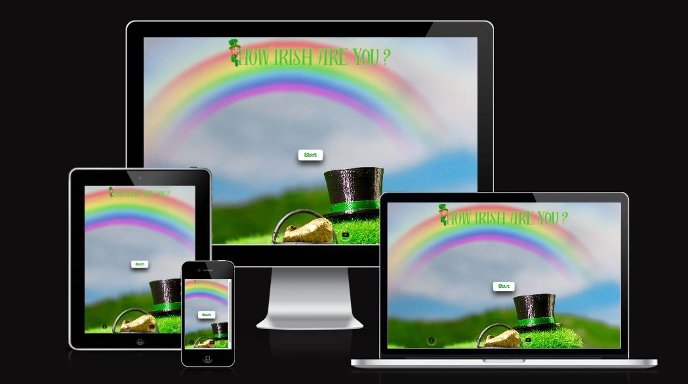

## Compatability

In order to ensure the website has the correct compatability, functionality and responsiveness, I checked it on both Microsoft Edge and Google Chrome.

*   Microsoft Edge

*   Google Chrome

## Responsiveness

The website was also checked manually using Devtools on both Microsoft Edge and Google Chrome.
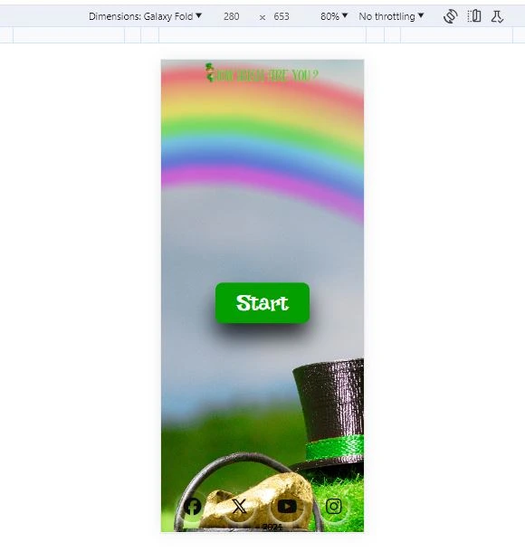

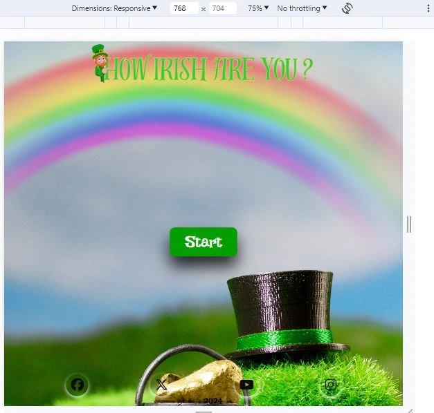

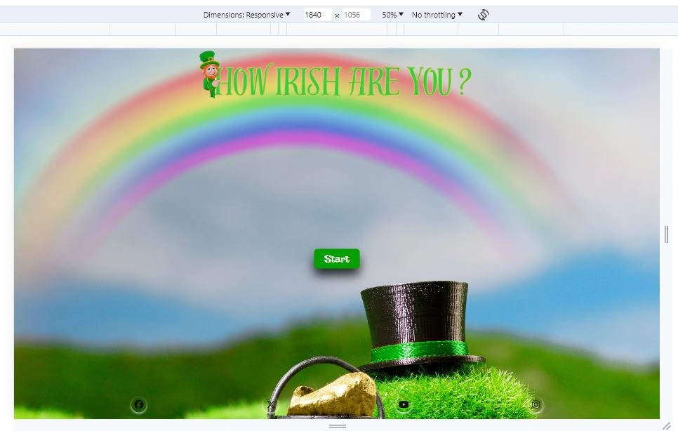

### Responsive Viewer
The website was also checked using the responsive viewer extention on google chrome which shows the website on various different screen sizes.

*   Start Page
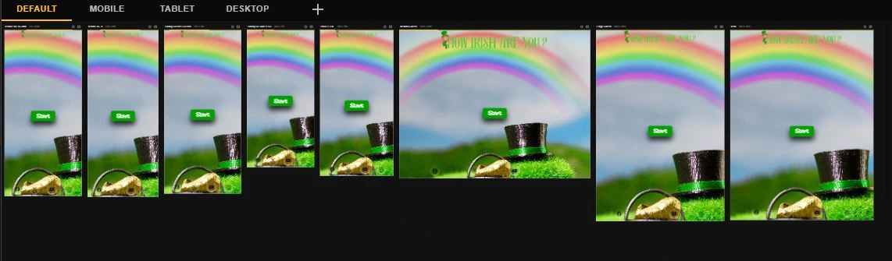

*   Information popup box.
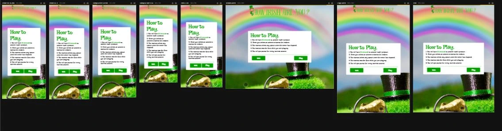

*   Quiz Area
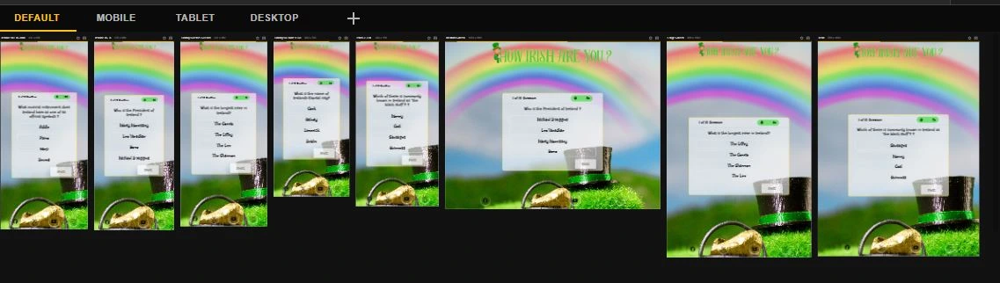

*   Result Area
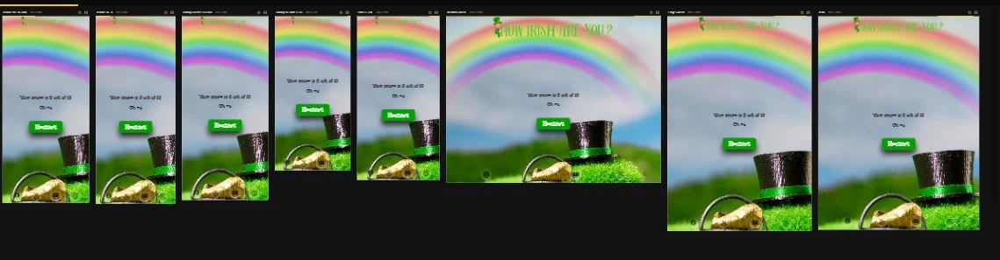

## Manual Testing

| feature | action | expected result | tested | passed | comments |
| --- | --- | --- | --- | --- | --- |
|  | | | | | |
| Start | Click on the "Start" button | The user is direceted to the a popup Information box | Yes | Yes | - |
| Pop Up Information box | Click on the "Exit" button | The user is redirected back to the main start screen | Yes | Yes | - |
|  | Click on the " Play" button| The user is directed to another popup box containing a quiz | Yes | Yes | - |
| Quiz Display Box | | | | | |
|  | Click on one of the answer options to the question displayed | The user is informed if answer is correct or incorrect | Yes | Yes | - |
|  | Click on "next" button | The user is directed to the next question | Yes | Yes | - |
| Results Page | Click on the "Restart" button  | The user is redirected to the start of the quiz | Yes | Yes | - |
| Instagram icon in the footer | Click on the Instagram icon | The user is redirected to the Instagram page | Yes | Yes | - |
| Facebook icon in the footer | Click on the Facebook icon | The user is redirected to the Facebook page | Yes | Yes | - |
| Twitter icon in the footer | Click on the Twitter icon | The user is redirected to the Twitter page | Yes | Yes | - |
| YouTube icon in the footer | Click on the YouTube icon | The user is redirected to the YouTube page | Yes | Yes | - |

## Validator Testing
 All the HTML and CSS code  has been run through The W3C HTML Markup Validation Service and the The W3C CSS Markup Validation Service to test the code for any errors. No errors were found.

*   HTML Validation

 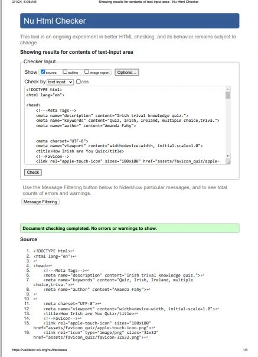

 *  CSS Validation

 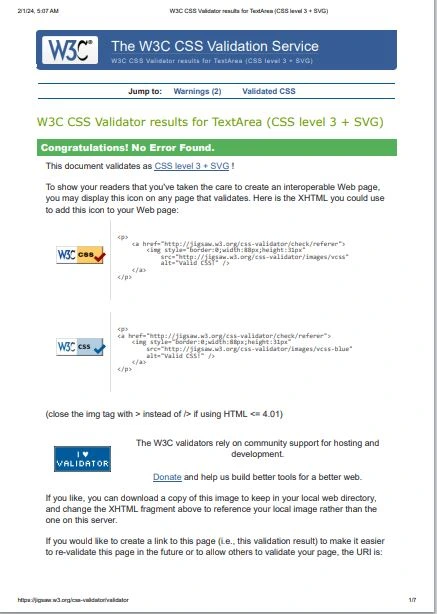

 *  JSHint Validation

    *   I checked my JavaScript code using JSHint and had three issues:
    *    one was that questionsArray was undefined , however this is defined in a seperate file called questions.py.
    *   Two was that checkAnswer is an unused variable , however checkAnswer is used in the function checkAnswer which checks if the user selected answer is correct or incorrect. 
    *   Three was in my questions.js file where JSHint said questionsArray was an unsued varaiabe  again this was used in another file called script.js

*   script.js

 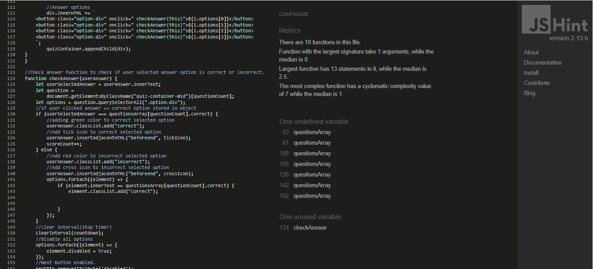

*   questions.js

 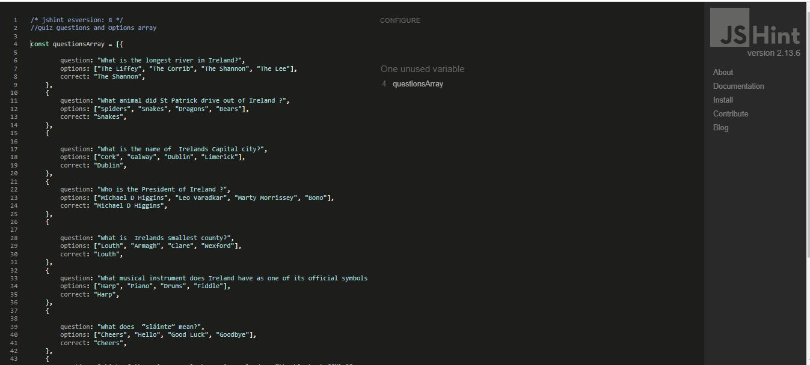

## Lighthouse Report

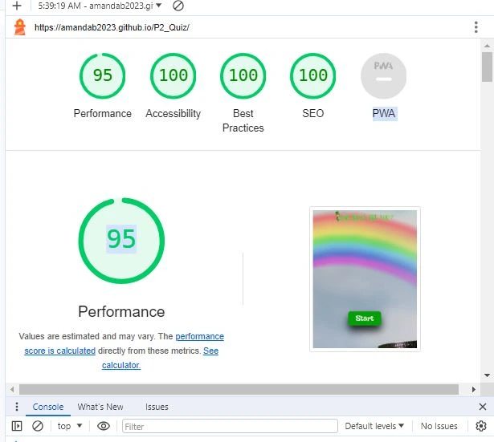

##  Bugs

*   I did have an issue getting my timer to move to the next question when the 10 second had elapsed.

*   I also had an issue getting my questions to show up in the quiz display box.

 ## Unsolved Bugs
No known bugs, no bugs appeared during my testing.